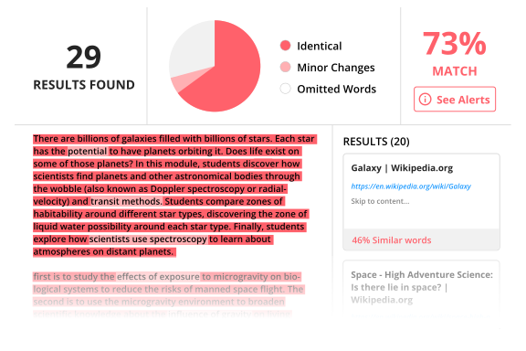

# plagiaCheck

Python program checking the level of plagiarism between multiple files (at least two). the program mainly is based on sci-kit library to first vectorize the texts and then check their cosine dot product similarity to get a score of similarity between 0 and 1.
For the testing I don't think that the cosine dot product similarity is very accurate, so I might add other mechanisms to check the similarity and make the decision making hybrid.
